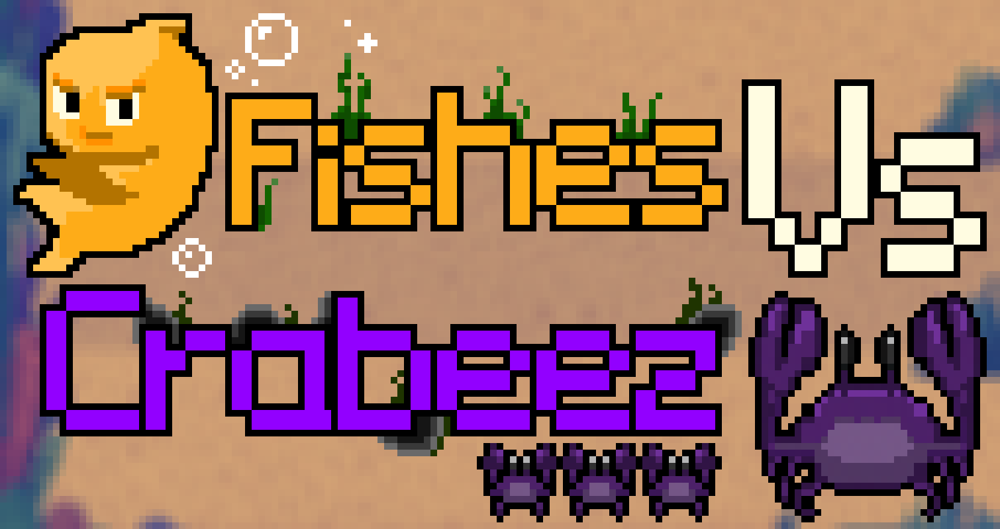

**Fishes VS Crabeez** is an upcoming [browser game](https://en.wikipedia.org/wiki/Browser_game) designed for French children.  
Its goal is to teach math and keyboard skills through a fun and engaging experience.

Players will be able to:
- Track their progress with customizable statistics
- Team up with friends to defend against waves of crab enemies, or play solo in single-player mode
- Earn badges to showcase their achievements and skills
- Collect coins and buy cosmetics to personalize their character

**Stay tuned as development progresses!**

## Credits

Development by the member of the BarbaTeam:
- Patrick Bizot
- Deyann Koperecz

Assets & music :
- Deyann Korperecz (pixel-art)
- Mathias Hellal (boss music)
